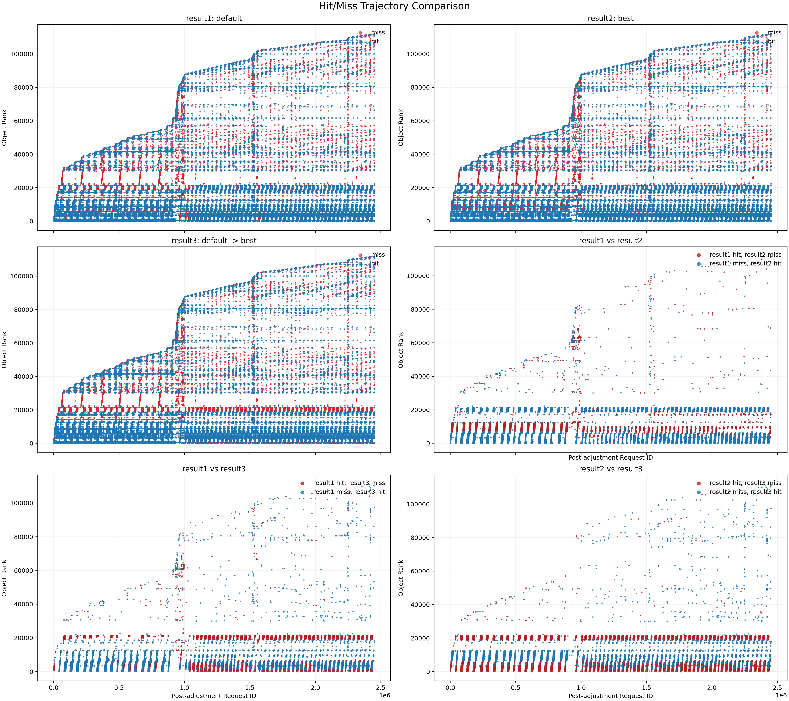

Background: we are working on a learned cache project, basic idea is:
for a trace, we use first 20% traces for feature extraction, then we use this feature to predict the best parameters for the remaining 80% traces. However, in order to avoid ad-hoc parameter tunning, we do the
labeling via search best parameter for the whole trace.
Then it introduces a problem: for the same trace, we have three settings
1. default parameters for the whole trace
2. default parameters for 20% trace + best parameters for the remaining 80% trace
3. best parameters for the whole trace

We have a hypothesis is that case 3 < case 2 < case 1 in terms of miss ratio, but we find that sometimes case 2 would be worse than case 1 (miss ratio high), which is counterintuitive.

Then we conducted a typical analysis over `/mnt/cfs/oracleReuse/tencentBlock/tencentBlock.ns4712.oracleGeneral.zst`. with code [compare.sh](../grid_search/analysis_output/compare.sh) [analyze_compare_results.py](../grid_search/analysis_output/analyze_compare_results.py) and the result is shown in the figure below:

> note: the value for `after-n-reqs` can be calculated by 20% * number of total requests in the trace, which is 20% * 1,000,000 = 200,000 in this case. total request number can be found in [cluster_stats.csv](../grid_search/analysis_output/cluster_stats.csv)

And in this case, our analysis result is that
a. diagnose the tail cases: it happens when the whole trace optimal mismatches the optimal for switching after 20% requests
             The mismatching can be attributed as a combination is too specific to one trace.
	    A typical example is tencentBlock.ns4712.oracleGeneral.zst, under cache size ratio = 0.1, best parameter is small 0.2;  ghost 3; s -> m thres 1; g -> m thres 1; skip ratio -> 25%.
             Result 1: whole trace default - miss ratio 0.3122
             Result 2: whole trace optimal - miss ratio 0.2744
             Result 3: default 20% + switching to whole trace optimal - 0.3879
             If we plot the miss/hit after 20% requests, we find that a common point is the cache size cannot cover the frequently requested scan pattern. However, whole trace optimal utilizes the limited cache space in an efficient way (not general enough) and it highly depends on the cache state (vulnerable). - Shown in the figure

Another evidence is when we increase the cache size ratio to 0.2, the miss ratios have no difference as follows
             Result 1  - miss ratio 0.0810
             Result 2  - miss ratio 0.0782
             Result 3  - miss ratio 0.0782

b. inspired by this, we are conducting label cleaning to remove labels that are too specialized for certain traces via check the behavior of similar hyperparameters.

Now you are a analyzer with expertise, please try to analyze other traces with similar behavior (means case 2 is worse than case 3) and how to explain each case.

Before you start, let me tell you how to find those cases.

- [optimal.csv](../grid_search/analysis_output/optimal.csv) contains the miss ratio for case 3 for all the traces, note that case 3 corresponds to miss_ratio column
- [case2.csv](../grid_search/analysis_output/case2.csv) contains the miss ratio for case 2 for all the traces, note that case 2 corresponds to miss_ratio column
- [baseline01.csv](../grid_search/analysis_output/baseline01.csv) contains the miss ratio for case 1 for all the traces with default parameters and cache size ratio = 0.1 (find records with s3fifo algo)
- [baseline001.csv](../grid_search/analysis_output/baseline001.csv) contains the miss ratio for case 1 for all the traces with default parameters and cache size ratio = 0.01 (find records with s3fifo algo)
- [baseline0001.csv](../grid_search/analysis_output/baseline0001.csv) contains the miss ratio for case 1 for all the traces with default parameters and cache size ratio = 0.001 (find records with s3fifo algo)

Then you can find the traces with similar behavior by comparing the miss ratios for case 1 and case 2, and then analyze the possible reasons for the observed behavior.
